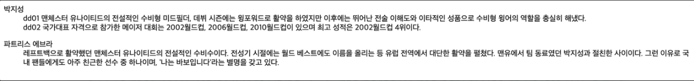

# HTML 태그
현재 HTML에는 130여개의 태그가 있습니다. 우리가 사용하기에는 너무나도 많은 양이죠. 그러므로 태그는 외우는 것이 아니라, 필요할 때 찾아 쓸 수 있어야 합니다.
그럼에도 실제로 대다수의 웹 페이지를 구성하는 태그는 약 25개 정도 입니다. HTML 기본 구조로써 필요한 <html>과 같은 태그들을 제외하면 그 개수는 더욱 적어지겠죠? 그렇기 때문에 우리는 태그 개수에 대한 압박감을 느끼지 않아도 됩니다.
중요한 것은 브라우저가 잘 이해할 수 있도록 Sementic Markup을 하는 것 입니다.

**ref** : [1) HTML 태그 소개](https://www.boostcourse.org/cs120/lecture/92878/?isDesc=false)


# 제목과 단락 요소
HTML의 시작은 문서를 공유하기 위해서였던 만큼 제목과 단락 등과 같은 문서의 기본적인 요소를 나타내는 태그들이 있습니다. 
첫 번째는 Heading 태그 입니다. 이름 그대로 제목을 작성할 때 사용하는 태그이며, 사용은 <h1></h1>으로 사용합니다. 숫자는 1~6까지 사용할 수 있습니다. 즉 h1~h6 태그가 존재한다는 것 입니다.
h1 태그는 순서대로 사용하는 것이 좋습니다. h1을 쓰고 그 다음 텍스트에 h3를 마크업하지 말라는 얘기입니다. h1 다음에는 h2를 사용해야 하죠.
두 번째는 Paragraph 태그 입니다. 이름 그대로 문단을 작성할 때 사용되는 태그이며, 사용은 <p></p>로 사용합니다. p태그를 쓰면 자동적으로 개행이 되며, p태그 내부에서 개행을 하기 위해서는 <br>태그가 필요합니다.
<br>태그는 빈 태그로써 종료 태그가 없습니다. linebreak의 약자로 텍스트의 개행에 관여합니다.

**ref** : [2) 제목과 단락요소](https://www.boostcourse.org/cs120/lecture/92877/?isDesc=false)


# 텍스트를 꾸며주는 요소
웹 표준화가 대두되면서 웹 문서의 구조와 표현을 분리하였습니다. 그 과정에서 많은 표현용 태그들이 사라졌고, 지금은 표현용 태그가 얼마 남지 않았습니다.
```
<b>, <i>, <u>, <s> 는 텍스트를 표현해주는 태그들 입니다. 의미를 부여하거나 선 또는 스타일 등을 정의합니다. 이 태그들은 의미가 없는 '표현용 태그'이기 때문에 사용에 주의를 요합니다.
<b> 태그는 bold를 의미하며, 텍스트를 굵게 표현해줍니다.
<i> 태그는 italic을 의미하며, 텍스트에 기울임을 표현해줍니다. <i> 태그는 HTML5부터 의미를 가지는 태그로 변경되었습니다.
<u> 태그는 underline을 의미하며, 텍스트에 밑줄을 표현해줍니다.
<s> 태그는 strike를 의미하며, 텍스트에 중간선을 표현해줍니다. 
```

**ref** : [3) 텍스트를 꾸며주는 요소](https://www.boostcourse.org/cs120/lecture/92879/?isDesc=false)


# 앵커 요소
<a>는 HT(Hyper Text)를 생성합니다. 즉 링크를 생성하는 태그이죠. 앵커 태그를 통해 다른 페이지로 이동하거나 현재 페이지 내에서 특정 위치로 초점을 이동시킬 수 있습니다.
HTML의 가장 큰 특징이 되는 태그이며, 그만큼 중요하고 자주 사용되는 태그입니다.
<a>태그를 사용하기에 앞서 <a>태그는 href 속성이 반드시 수반되어야 한다는 것을 기억해야 합니다. 즉 <a>태그를 통해 이동할 페이지의 url을 입력해주어야 한다는 것 입니다. 임시로 <a>태그를 만드는 경우에는 href="#"을 사용합니다. 이렇게 작성하면 그 <a>태그는 그 페이지 자체와 연결됩니다. 이처럼 임시로 a태그를 생성함에도 href가 반드시 필요하죠.
다음으로 a태그에서 자주 사용되는 속성으로 'target'이 있습니다. target 속성은 연결된 페이지가 어떤 방식으로 사용자 브라우저에서 열리게 될지를 결정합니다. 속성의 값으로 _self, _blank, _parent, _top이 있습니다.
_self는 링크를 현재 페이지에서 열도록 동작합니다. target 속성을 별도로 정의하지 않으면, _self가 기본값으로 정의됩니다.
_blank는 링크를 새 창에서 열도록 동작합니다. 그 외에 _parent와 _top이 있지만, 이 것은 프레임 안에서 동작하고 자주 사용하지 않는 속성입니다.
<a>태그에서 중요한 개념이 한 가지 더 있습니다. '내부 링크' 입니다. a태그는 외부 페이지만이 아니라 내부 요소에 초점을 맞출 수 있도록 동작합니다. 내부 링크를 쓰기 위해서는 href="#id" 형식으로 작성합니다. 여기서 id는 이동하고자 하는 요소의 id 값 입니다.

**ref** : [4) 앵커 요소](https://www.boostcourse.org/cs120/lecture/92880/?isDesc=false)


# 의미가 없는 컨테이너 요소
웹이 발전하면서 시각적으로 정보를 표현하는 방향으로 많이 발전했습니다. 애초에 문서 형태에서 많이 벗어나게 되었죠. 기존의 태그들로 현재의 다양한 콘텐츠를 표현하기에 부족하였기 때문에, 새로운 콘텐츠를 표현하기 위해 적합한 의미를 갖는 태그들이 생기기도 하였습니다. 그러나 적합한 태그가 없는 경우에는 주로 의미 없는 태그들을 사용합니다.

의미 없는 태그들 두 가지가 있습니다. 바로 <div>와 <span> 입니다. 단순히 요소를 묶기 위해서 사용되는 태그들 입니다. div태그는 블록 레벨 태그로써 태그 하나가 한 줄의 영역을 차지합니다. 즉 div태그가 한 줄에 작성되고 난 후, 다음 div태그는 개행이 되어 밑으로 내려가게 됩니다. 반면 span태그는 인라인 레벨의 태그입니다. 인라인 레벨은 자신의 내용만큼의 공간을 차지 합니다.

**ref** : [5) 의미가 없는 컨테이너 요소](https://www.boostcourse.org/cs120/lecture/92881/?isDesc=false)

# 리스트 요소
```
리스트 요소들로 <ul>, <ol>, <dl>이 있습니다. ul태그는 웹 페이지를 구성함에 있어서 가장 많이 사용하는 리스트 요소 입니다. unordered list의 약자로 순서가 없는 list를 나열할 때 사용합니다. ul태그 선언 후 그 안에 <li>태그를 선언하여 리스트를 작성합니다.

다음으로 <ol>태그 입니다. ol태그는 ordered list의 약자로 순서가 있는 list를 나열할 때 사용하는 태그입니다. ul태그와는 반대되는 태그이죠. ul태그와 동일하게 <li>태그를 사용하여 리스트를 추가, 작성합니다. 순서가 있는 list이기 때문에 각각의 list에 번호가 매겨집니다.

마지막 <dl>태그 입니다. dl태그는 ul, ol태그와는 구별이 되는 리스트 태그 입니다. dl태그는 용어와 설명이 한 세트로 묶여 list로 나열되는 구조를 갖고 있습니다. dl태그 안에 <dt>태그(용어 이름), <dd>태그(용어 설명)으로 구성되는 것 입니다. 그리고 용어 하나에 여러 개의 설명이 필요할 때 <dd>를 추가할 수 있습니다. <dt></dt><dd></dd><dd></dd> 와 같이 말이죠. 아래와 같이 작성할 수 있습니다.
사진01 
```

**ref** : [6) 리스트 요소](https://www.boostcourse.org/cs120/lecture/92882/?isDesc=false)


# 이미지 요소
HTML에서 이미지를 넣기 위해서 사용되는 태그는 태그가 있습니다. img태그는 종료태그가 없는 빈 태그로써, src와 alt라는 필수 속성을 수반합니다.

필수 속성인 src에는 이미지의 경로가 들어갑니다. 이미지의 경로가 지정되지 않는다면, 당연하게도 이미지가 보여지지 않겠지요. 그러므로 src 속성은 img태그를 사용함에 있어서 필수적입니다. src 경로에는 두 가지 경로가 있습니다. 상대경로와 절대경로 입니다. 상대경로는 현재 페이지를 기준으로 상대적인 주소 참조를 의미합니다.
./로 시작하여 해당 이미지의 위치까지 작성합니다. 예를 들면 src="./imges/apple.png/" 라고 작성할 수 있습니다. 그러면 현재 위치에서 images 폴더를 찾아 apple.png를 가져오게 되는 것이죠.
그리고 절대경로는 이미지가 실제 위치한 전체 경로를 의미합니다. src="C:/users/document/images/apple.png" or src="http://www.naver.com/apple.png" 와 같이 작성될 수 있겠죠.

src와 더불어 필수 속성인 alt는 이미지의 대체 텍스트를 정의합니다. 이미지가 어떠한 이유로 웹페이지 상에 표시되지 않을 때, 이미지를 대체하여 이 자리에는 어떤 이미지가 들어가는지를 텍스트로 표현해주는 것 입니다. 예를 들면 '사과'라는 이미지를 넣었고 그 이미지가 어떠한 이유로 표시되지 않을 때, alt="사과" 라고 정의하여 그 사과 이미지 자리에 '사과'라는 대체 텍스트가 보여지게 하는 것 입니다.
```
와 같이 작성하면 됩니다.
```


이미지 크기에 관한 속성은 width/height가 있습니다. 너비와 높이를 설정하는 속성이죠. 이 것은 선택 속성이므로, 정의하지 않으면 원본 이미지 크기 만큼의 너비와 높이를 갖게 됩니다.
자주 사용되는 이미지 포맷으로는 gif, jpg, png가 있습니다.

**ref** : [7) 이미지 요소](https://www.boostcourse.org/cs120/lecture/92883/?isDesc=false)


# 테이블 요소
```
테이블 태그는 데이터를 표로 나타날 때 사용됩니다. <table>로 정의합니다.
table 요소 안에서 사용되는 태그는 기본적으로 행을 나타내는 <tr>, 제목 셀 <th>, 셀 <td>가 있습니다. <th>와 <td>는 <tr>의 자식 요소가 됩니다. 그러니까 <tr>태그 한 줄에 th태그와 td태그가 포함될 수 있다는 것 입니다. 하지만 th를 필수적으로 사용해야 하는 것은 아닙니다. td태그 단독으로도 사용될 수 있습니다.
그렇게 <tr>태그 하나 하나가 모여 <table>을 구성합니다.

표가 복잡해지면서 표를 구조적으로 파악할 수 있는 태그의 사용이 필요해졌습니다. 표를 좀 더 구조적으로 표현하기 위해서, <table> 태그 안에 <caption>, <thead>, <tbody>, <tfoot>을 사용할 수 있습니다.
태그 이름대로 <caption>은 표 제목을 의미합니다. <thead>는 표의 제목 행을 그룹화합니다. <tbody>는 표의 본문 행을 그룹화합니다. <tfoot>은 표의 바닥 행을 그룹화합니다. <tr><th></th><td></td><tr>와 같은 여러 개의 tr요소를 자식 요소로 두어 그룹화하는 것 입니다.
```

**ref** : [8) 테이블 요소 1](https://www.boostcourse.org/cs120/lecture/92884/?isDesc=false)

**ref** : []()
**ref** : []()
**ref** : []()
**ref** : []()
**ref** : []()
**ref** : []()
**ref** : []()
**ref** : []()